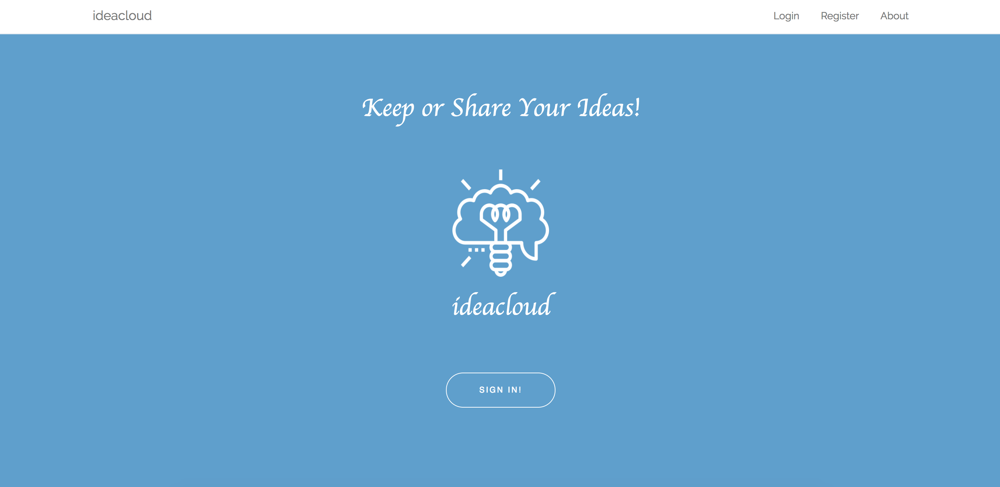
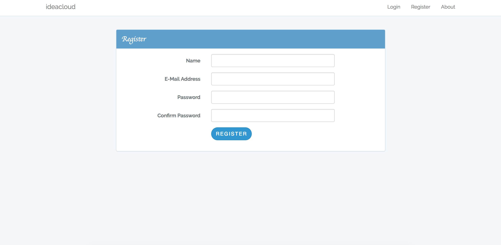
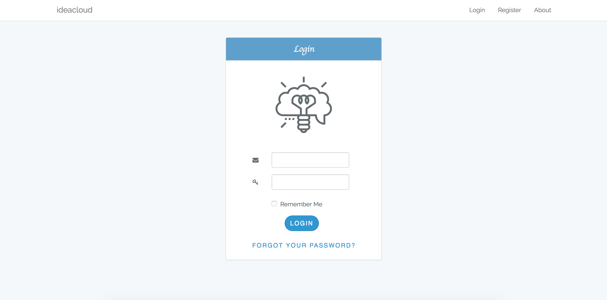
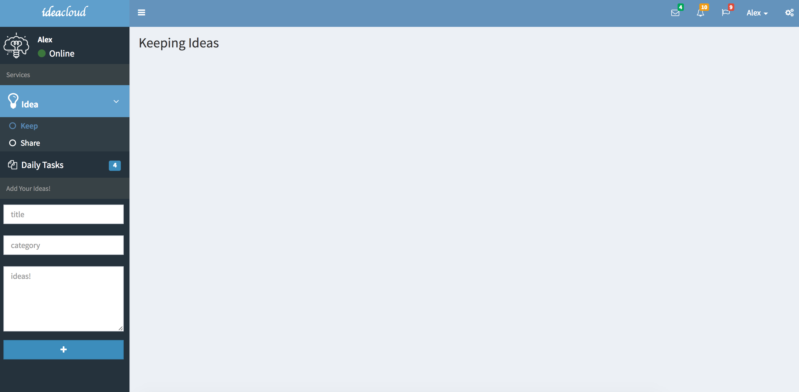
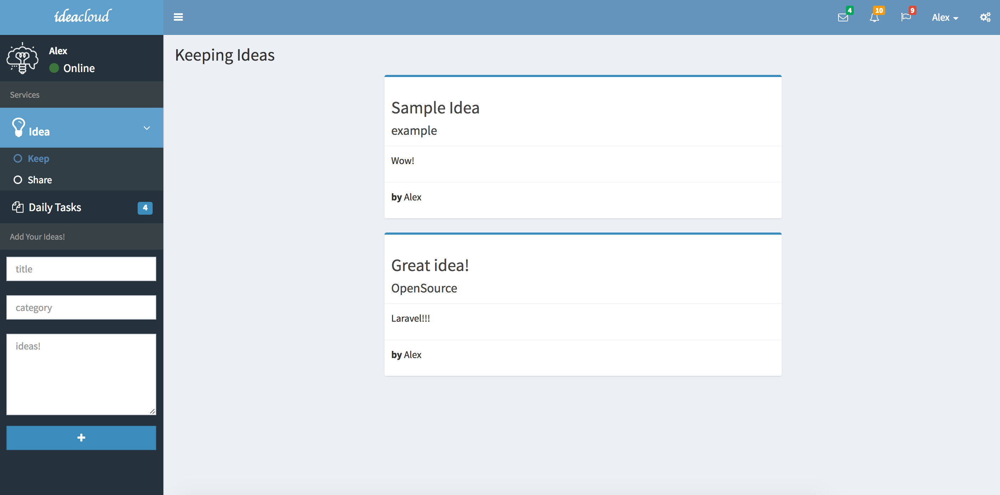
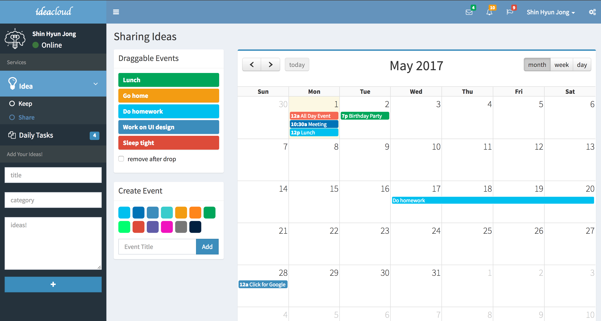

## Ideacloud

Ideacloud is storage service which is able to keep or share your ideas.

- Keep or Share your Creative ideas. Also, you can save your ideas with categories. If you are having hard time to think creative ideas look at other people's ideas and try to copycat!
- Todo apps. You can update and manage your daily tasks and 
 
## Framework
- Ideacloud is built with PHP Framework Laravel 5.3

## DATABASE
- MySQL

## Libraries
- CSS Framework::Bootstrap
- jQuery
- Datatables.js
- AdminLTE.css (Admin css theme)
- fullcalendar.js
- morris chart.js

## License

Ideacloud is open-sourced software licensed under the [MIT license](http://opensource.org/licenses/MIT).

## About Ideacloud

This is Main Page when you accessed to my App.

This is Register page that you can make your own ID&PW.

This is Login Page. Type your ID & PW which you made it on register page.

This is your own main page when you accessed on Ideacloud. You can see your name, online state, and Tabs which you can use.

You can add your Ideas through this tab.

You can see your Calendar through this tab.

### Functions On Ideacloud

* Login
* Register
* Find your PW via Email when you forgot.
* Keep your own ideas(Other people cannot see your ideas.)
* Share your ideas(Other people can see your ideas.)
* Edit your ideas.
* Delete your ideas.
* To-Do Apps.
* Your personnel Calendar.
* Security (your pw is bcrypted. -> SuperSafe!)
* full caldendar.js
* worldmap

